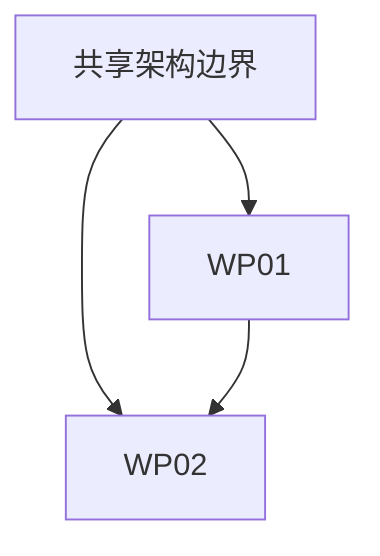

# 任务拆分方案（Task Breakdown）

> 基于需求基线：`.dev-flow/runs/{需求编号}/PRD.md` / 会话内精简需求基线
> 生成时间：{timestamp}
> 版本：v1.0

---

## 1. 需求拆分就绪

**需求基线结论**：`READY`

| 检查项 | 证据 |
|-------|------|
| UC 的目标、触发/前置条件、主/异常流程明确 | ... |
| 状态变化和设计状态足以拆分 | ... |
| 验收标准可验证 | ... |
| 高影响未知项已有证据或验证计划 | ... |

> 需求基线为 `BLOCKED` 时不得生成候选工作包。

---

## 2. 工作包清单

| 工作包 | 名称 | 范围 | 覆盖 UC | 涉及页面/模块 | 独立验收 | 业务优先级 |
|-------|------|------|---------|--------------|---------|-----------|
| WP01 | {名称} | {包含与不包含} | UC01, UC02 | {模块} | 是/否，依据：... | 高/中/低/待确认 |
| WP02 | {名称} | {包含与不包含} | UC03 | {模块} | 是/否，依据：... | ... |

### 2.1 工作包拥有与引用边界

| 工作包 | 拥有的组件/类型/API/状态 | 引用的共享资源 | 交付边界 | 回滚边界 |
|-------|-------------------------|----------------|---------|---------|
| WP01 | ... | ... | ... | ... |

---

## 3. UC 与工作包映射

| UC | 用户目标 | 工作包 | 验收标准位置 | 页面/回归范围 |
|----|---------|-------|-------------|--------------|
| UC01 | ... | WP01 | PRD §... | ... |
| UC02 | ... | WP01 | PRD §... | ... |
| UC03 | ... | WP02 | PRD §... | ... |

**覆盖检查**：全部 UC 已映射 / 以下 UC 未映射：...

> 多个 UC 可以映射到同一工作包；一个 UC 跨独立架构边界时可以映射到多个工作包并说明原因。

---

## 4. 工作包依赖分析

### 4.1 共享架构边界

| 共享项 | 使用方工作包 | 处理方式 |
|-------|-------------|---------|
| {统一数据模型} | WP01, WP02 | 共享架构统一定义 |
| {组件/API/状态} | ... | ... |

### 4.2 依赖关系

- WP01 依赖：无。
- WP02 依赖 WP01：{具体契约或产物}。
- 循环依赖：无。

### 4.3 共享架构产物判定

**是否需要 `GLOBAL-ARCHITECTURE.md`**：是 / 否

**依据**：存在跨工作包共享契约 / 不存在共享架构边界，证据：...

---

## 5. 编排决策

| 维度 | 结论 | 理由 |
|------|------|------|
| 需求清晰度 `requirementClarity` | `clear` / `unclear` | ... |
| 任务复杂度 `complexity` | `trivial` / `simple` / `moderate` / `complex` | ... |
| 执行拓扑 `topology` | `single-workstream` / `multi-workstream` | ... |
| 风险等级 `risk` | `low` / `medium` / `high` | ... |
| 共享架构 `hasSharedArchitecture` | `true` / `false` | ... |
| 治理深度 `governance` | `fast` / `standard` / `rigorous` | ... |
| 需求发现深度 | `light` / `standard` / `deep` | ... |
| 调度版本 `scheduleVersion` | `v{n}` | 新证据触发重编排时递增 |

**Orchestrator 最终理由**：...

### 5.1 方案作者与技术审核

| 工作包/共享层 | 方案作者 | 技术审核者 | Architect 触发器 | 用户确认范围 |
|---------------|---------|-----------|-------------------|-------------|
| WP01 | Developer / Architect | 无（Fast）/ Liu（Standard）/ Architect（Rigorous） | 共享契约、权限、安全、不可逆操作、复杂状态或高技术不确定性 | 职责、范围、取舍和残余风险 |
| 共享层 | Architect / 不适用 | Architect / 不适用 | 存在跨工作包共享契约或关键基础 | 共享职责、影响范围和风险 |

### 5.2 风险与治理信号

| 信号 | 是否存在 | 影响 |
|------|---------|------|
| 共享契约修改 | 是/否 | ... |
| 权限或安全边界 | 是/否 | ... |
| 异步提交、重试或状态切换 | 是/否 | ... |
| 不可逆操作 | 是/否 | ... |
| 高不确定性或高影响 | 是/否 | ... |

### 5.3 升级触发器

| 升级触发器 | 当前路线 | 触发后的路线/动作 |
|-----------|---------|------------------|
| 发现需要修改全局契约 | single-workstream / standard | 暂停并重新判断拓扑，至少 rigorous |
| 工作包无法独立验收 | multi-workstream | 回退任务拆分，合并工作包 |
| {其他可观察触发器} | ... | ... |

> 执行中只允许升级，不自动降级。

### 5.4 Agent 调度表

**scheduleVersion**：`v{n}`

| id | agent | role | dependsOn | parallel | HANDOFF | stopWhen |
|----|-------|------|-----------|----------|---------|----------|
| WP01-developer | developer | proposal-and-implementation | [] | false | `.dev-flow/runs/{需求编号}/work-packages/WP01/HANDOFF.md` | 发现共享契约；风险升级 |
| WP01-reviewer | code-reviewer | independent-review | [WP01-developer] | false | `.dev-flow/runs/{需求编号}/work-packages/WP01/HANDOFF.md` | 缺少真实运行证据 |

### 5.5 重编排记录

命中 `stopWhen` 时停止相关调度项，记录新证据，废弃并替换旧调度；不得向旧调度末尾追加补丁项。执行中只允许自动升级。

---

## 6. 执行顺序

| 批次 | 工作包/共享基础 | 理由 | 完成证据 |
|------|----------------|------|---------|
| 第 0 批 | 共享架构（如需要） | 为依赖工作包提供稳定契约 | `global-architecture-proposal` 结构校验 + 用户确认 + `global-architecture` 最终校验 |
| 第 1 批 | WP01 | 无前置依赖 / 被 WP02 依赖 | UC 映射测试与验收 |
| 第 2 批 | WP02 | 依赖 WP01 的 ... | ... |

---

## 7. 工作包验收标准

### WP01：{名称}

- [ ] 覆盖 UC01、UC02 的验收标准。
- [ ] 可以独立测试、交付和回滚，或已明确合并原因。
- [ ] 设计稿正常/加载/空/错误/禁用/权限状态已覆盖或证明不适用。
- [ ] typecheck、lint、test、build 按项目实际能力提供运行证据。
- [ ] `multi-workstream` 中已向用户提交本工作包验收交接，并获得明确完成确认后才进入下一工作包。

### WP02：{名称}

- [ ] ...

---

## 8. 风险与待确认项

| 风险/待确认 | 影响的工作包/UC | 建议 |
|------------|-----------------|------|
| {业务优先级未确认} | WP01 / UC01 | 请用户确认优先级 |
| {共享契约规格不明确} | WP01, WP02 | 验证后再进入共享架构 |

---

## 9. 用户确认区

- [ ] 需求基线事实、范围和非目标正确。
- [ ] 工作包边界与 UC 映射完整。
- [ ] 依赖和执行顺序符合业务优先级。
- [ ] 编排理由、升级触发器和残余风险已理解。
- [ ] 已理解多工作包将逐包暂停验收，不会在未确认当前包时继续开发下一包。
- [ ] （如有调整）：________________。
