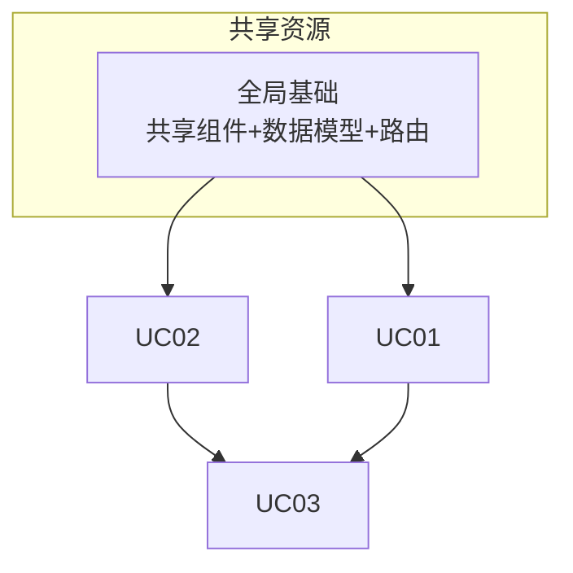

# 任务拆分方案（Task Breakdown）

> 基于全局 PRD：`artifacts/PRD.md`
> 生成时间：{timestamp}
> 版本：v1.0

---

## 1. 工作量概览

- **本次工作量包含**：{N} 个 UC
- **共享资源**：{M} 个（共享组件 / 数据模型 / API / UI 基础）
- **预估执行批次**：{K} 批

---

## 2. UC 任务清单

| UC 编号 | 名称 | 核心功能 | 子屏/弹窗数 | 业务优先级 | 依赖 |
|---------|------|---------|------------|-----------|------|
| UC01 | {名称} | {一句话} | {N} | 高/中/低/待确认 | 无 / 依赖 UC0X |
| UC02 | {名称} | {一句话} | {N} | 高/中/低/待确认 | ... |
| UC03 | 词汇审核页面 | 审核词条、编辑释义、通过/不通过 | 6 | {待确认} | 依赖共享词条详情弹窗 |

---

## 3. 跨 UC 依赖分析

### 3.1 共享组件

| 组件 | 使用方 UC | 处理方式 |
|------|----------|---------|
| 词条详情弹窗 | UC02, UC03 | 提取到全局共享组件，全局架构阶段统一设计 |
| StatusBadge | UC01, UC02, UC03 | 提取到基础 UI 组件库 |
| 分页组件 | UC01, UC03 | 复用/提取 |

### 3.2 共享数据模型

| 类型 | 使用方 UC | 处理方式 |
|------|----------|---------|
| `词条 (Entry)` | UC01, UC02, UC03 | 统一数据模型，全局 types |
| `释义 (Definition)` | UC02, UC03 | 统一数据模型 |
| `审核状态 (ReviewStatus)` | UC03 | 全局 types |

### 3.3 共享 API

| API | 使用方 UC | 处理方式 |
|-----|----------|---------|
| 词条列表查询 | UC01, UC03 | 全局 services |
| 词条详情查询 | UC02, UC03 | 全局 services |
| 审核操作（通过/不通过） | UC03 | UC03 专属 |

### 3.4 全局基础

| 项 | 说明 |
|----|------|
| 路由/布局 | Layout、Header、侧边栏 → 全局架构阶段统一设计 |
| 全局状态 | 用户权限、全局筛选 → 全局 store |
| 设计 Token | 颜色/字体/间距体系 → 全局样式系统 |

---

## 4. 依赖关系图

或用文字描述：
- 全局基础（共享组件库、统一数据模型、路由布局）→ 所有 UC 依赖
- UC02 → UC03（UC03 复用 UC02 的词条详情弹窗）
- 无循环依赖 ✅

---

## 5. 执行顺序建议

| 批次 | 任务 | 理由 |
|------|------|------|
| 第 0 批 | 全局架构（共享组件库 + 统一数据模型 + 路由布局） | 所有 UC 的地基，必须先行 |
| 第 1 批 | UC01 {名称} | 被 UC03 依赖 / 核心流程 |
| 第 2 批 | UC02 {名称} | 被 UC03 依赖（词条详情弹窗） |
| 第 3 批 | UC03 词汇审核页面 | 依赖 UC01/UC02 的共享资源 |

**排序依据**：
1. 全局基础先行（地基）
2. 被依赖的 UC 先行（UC02 的弹窗被 UC03 复用）
3. 结合业务优先级（{用户提供的优先级}）

---

## 6. 每个任务的验收标准

### UC01: {名称}
- [ ] {验收标准 1}
- [ ] {验收标准 2}
- [ ] 设计稿 1:1 还原
- [ ] 测试覆盖空/加载/错误状态

### UC02: {名称}
- [ ] ...

### UC03: 词汇审核页面
- [ ] 审核列表正确展示
- [ ] 词条详情弹窗（空状态 + 有释义）正确展示
- [ ] 编辑词条表单可正常提交
- [ ] 审核通过/不通过流程完整
- [ ] 设计稿 1:1 还原
- [ ] 测试覆盖空/加载/错误状态

---

## 7. 风险与待确认项

| 风险/待确认 | 影响 | 建议 |
|------------|------|------|
| {UC 业务优先级未确认} | 影响执行顺序 | 请用户确认各 UC 优先级 |
| {某共享组件规格不明确} | 影响全局架构 | 需设计师补充 |

---

## 8. 用户确认区

请确认以下内容后，流水线进入全局架构阶段：

- [ ] UC 任务清单完整、无遗漏
- [ ] 跨 UC 依赖识别正确
- [ ] 执行顺序合理
- [ ] 各 UC 业务优先级已确认
- [ ] （如有调整）：________________