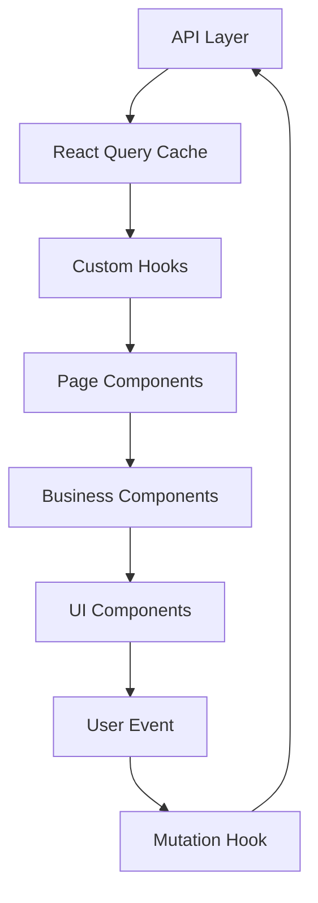

# TDD（技术设计文档）

> 基于 PRD：`artifacts/PRD.md`
> 生成时间：{timestamp}
> 版本：v1.0

---

## 1. 技术方案概览

| 项目 | 选择 |
|------|------|
| 框架 | {React 18 / Vue 3 / 其他} |
| 语言 | TypeScript |
| 构建工具 | {Vite / Webpack / 其他} |
| CSS 方案 | {Tailwind CSS / CSS Modules / styled-components} |
| 状态管理 | {Zustand / Redux Toolkit / Pinia / Context} |
| 服务端状态 | {React Query / SWR / Apollo Client} |
| 路由 | {React Router / Vue Router} |
| 测试框架 | {Vitest + Testing Library / Jest} |
| 组件库 | {Ant Design / 自研 / 无} |

---

## 2. 组件树

### 2.1 页面级组件树

```
App
├── Layout
│   ├── Header
│   │   ├── Logo
│   │   ├── Navigation
│   │   └── UserMenu
│   ├── Sidebar (可选)
│   └── Content
│       └── <Outlet /> (路由出口)
│
├── FeatureListPage
│   ├── PageHeader
│   │   ├── Title
│   │   └── ActionButton (新建)
│   ├── SearchBar
│   │   ├── SearchInput
│   │   └── FilterSelect
│   ├── FeatureTable
│   │   ├── TableHeader
│   │   └── TableRow (× N)
│   │       ├── StatusBadge
│   │       └── ActionDropdown
│   └── Pagination
│
├── FeatureDetailPage
│   ├── PageHeader (with back button)
│   ├── DetailCard
│   │   ├── FieldGroup
│   │   └── StatusTimeline
│   └── ActionBar
│
└── FeatureCreatePage / FeatureEditPage
    └── FeatureForm
        ├── FormSection (基本信息)
        ├── FormSection (详细配置)
        └── FormActions (提交/取消)
```

### 2.2 通用组件清单

| 组件 | 路径 | 用途 | 是否新增 |
|------|------|------|---------|
| StatusBadge | `components/ui/StatusBadge` | 状态标签 | 新增 |
| SearchBar | `components/business/SearchBar` | 通用搜索栏 | 新增 |
| ... | ... | ... | ... |

### 2.3 组件 Props 契约

#### FeatureTable

```typescript
interface FeatureTableProps {
  data: Feature[];
  loading: boolean;
  error?: Error | null;
  onRowClick?: (item: Feature) => void;
  onAction?: (action: string, item: Feature) => void;
  pagination?: PaginationProps;
}
```

#### StatusBadge

```typescript
interface StatusBadgeProps {
  status: FeatureStatus;
  size?: 'small' | 'default';
}
```

（每个关键组件都需要定义 Props 契约）

---

## 3. 数据流设计

### 3.1 数据流概览



### 3.2 状态归属

| 状态 | 类型 | 管理方式 | 所属组件/Hook |
|------|------|---------|-------------|
| 列表数据 | 服务端 | React Query | `useFeatureList` |
| 筛选条件 | URL 参数 | useSearchParams | `useFeatureFilters` |
| 表单数据 | 临时 | useState | `FeatureForm` |
| 提交状态 | 临时 | useMutation | `useFeatureMutation` |
| 全局通知 | 全局 | Context | `NotificationContext` |

### 3.3 关键数据流路径

**列表页搜索流程：**
```
用户输入关键词 → SearchInput onChange → useFeatureFilters 更新 URL 参数
→ useFeatureList queryKey 变化 → React Query 自动 refetch
→ FeatureTable 重新渲染
```

**表单提交流程：**
```
用户点击提交 → FeatureForm validate → useFeatureMutation.mutate
→ API 调用 → onSuccess: 更新缓存 + 跳转列表页
→ onError: 显示错误提示
```

---

## 4. 路由设计

```
/feature
├── /feature/list              → FeatureListPage     (懒加载)
├── /feature/:id               → FeatureDetailPage   (懒加载)
│   └── /feature/:id/edit      → FeatureEditPage     (懒加载，权限守卫)
└── /feature/create            → FeatureCreatePage   (懒加载，权限守卫)
```

**路由配置：**
```typescript
const featureRoutes = [
  {
    path: '/feature',
    element: <FeatureLayout />,
    children: [
      { index: true, element: <Navigate to="list" /> },
      { path: 'list', element: <FeatureListPage /> },
      { path: ':id', element: <FeatureDetailPage /> },
      { path: ':id/edit', element: <AuthGuard><FeatureEditPage /></AuthGuard> },
      { path: 'create', element: <AuthGuard><FeatureCreatePage /></AuthGuard> },
    ],
  },
];
```

---

## 5. API 契约

### 5.1 获取列表

```
GET /api/features
```

```typescript
// 请求
interface GetFeatureListParams {
  page: number;
  pageSize: number;
  keyword?: string;
  status?: FeatureStatus;
  sortBy?: string;
  sortOrder?: 'asc' | 'desc';
}

// 响应
interface GetFeatureListResponse {
  code: number;
  message: string;
  data: {
    list: Feature[];
    total: number;
    page: number;
    pageSize: number;
  };
}

// 错误码
// 401: 未登录
// 403: 无权限
// 500: 服务器错误
```

### 5.2 创建

```typescript
interface CreateFeatureRequest {
  name: string;
  description?: string;
  status: FeatureStatus;
  // ...
}

interface CreateFeatureResponse {
  code: number;
  message: string;
  data: Feature;
}
```

（每个 API 都需要定义请求/响应/错误处理）

---

## 6. 状态管理策略

### 6.1 服务端状态（React Query）

```typescript
// hooks/useFeatureList.ts
export const useFeatureList = (params: FeatureListParams) => {
  return useQuery({
    queryKey: ['features', 'list', params],
    queryFn: () => getFeatureList(params),
    staleTime: 5 * 60 * 1000,   // 5 分钟内不重新请求
    placeholderData: keepPreviousData, // 翻页时保留旧数据
  });
};

// hooks/useFeatureMutation.ts
export const useCreateFeature = () => {
  const queryClient = useQueryClient();
  return useMutation({
    mutationFn: createFeature,
    onSuccess: () => {
      queryClient.invalidateQueries({ queryKey: ['features', 'list'] });
    },
  });
};
```

### 6.2 全局 UI 状态（Context / Zustand）

```typescript
// stores/notificationStore.ts
interface NotificationStore {
  notifications: Notification[];
  addNotification: (n: Notification) => void;
  removeNotification: (id: string) => void;
}
```

### 6.3 表单状态

使用组件内 `useState` + `useReducer`（复杂表单），不使用全局状态。

---

## 7. 性能策略

| 优化点 | 策略 | 位置 |
|--------|------|------|
| 路由懒加载 | `React.lazy` + `Suspense` | 所有非首页路由 |
| 列表虚拟化 | `@tanstack/react-virtual` | 超过 100 条的列表 |
| 搜索防抖 | `useDebounce` 300ms | `SearchInput` |
| 组件缓存 | `React.memo` | `TableRow`、`StatusBadge` |
| 计算缓存 | `useMemo` | 表格列定义、格式化数据 |
| 图片懒加载 | `loading="lazy"` + WebP | 所有内容图片 |
| API 缓存 | React Query staleTime | 按数据类型设置 |

---

## 8. 目录结构

```
src/
├── pages/
│   └── feature/
│       ├── FeatureListPage/
│       │   ├── index.tsx
│       │   ├── FeatureListPage.test.tsx
│       │   └── components/
│       │       ├── SearchBar.tsx
│       │       └── FeatureTable.tsx
│       ├── FeatureDetailPage/
│       │   ├── index.tsx
│       │   └── FeatureDetailPage.test.tsx
│       ├── FeatureCreatePage/
│       │   ├── index.tsx
│       │   └── FeatureCreatePage.test.tsx
│       └── FeatureEditPage/
│           ├── index.tsx
│           └── FeatureEditPage.test.tsx
├── components/
│   ├── ui/
│   │   └── StatusBadge/
│   │       ├── index.tsx
│   │       └── StatusBadge.test.tsx
│   └── business/
│       └── FeatureForm/
│           ├── index.tsx
│           └── FeatureForm.test.tsx
├── hooks/
│   ├── useFeatureList.ts
│   ├── useFeatureDetail.ts
│   └── useFeatureMutation.ts
├── services/
│   └── feature.ts
├── types/
│   └── feature.ts
└── constants/
    └── feature.ts
```

---

## 9. 设计 Token 映射

（将 PRD 中的设计 Token 映射到具体实现方案）

| 设计 Token | CSS 变量 | Tailwind 类（如使用） |
|-----------|---------|---------------------|
| `--color-primary` | `var(--color-primary)` | `text-primary` |
| `--spacing-md` | `var(--spacing-md)` | `p-4` |
| ... | ... | ... |

---

## 10. 附录

### 10.1 关键决策记录

| 决策 | 选项 | 选择 | 理由 |
|------|------|------|------|
| ... | ... | ... | ... |

### 10.2 风险与缓解

| 风险 | 影响 | 概率 | 缓解措施 |
|------|------|------|---------|
| ... | ... | ... | ... |