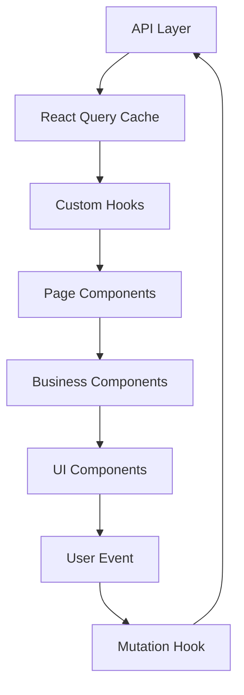

# TDD（技术设计文档）

> 基于 PRD：`.dev-flow/runs/{需求编号}/PRD.md`
> 生成时间：{timestamp}
> 版本：v1.0

---

## 1. 技术方案概览

| 项目 | 选择 |
|------|------|
| 框架 | {React 18 / Vue 3 / 其他} |
| 语言 | TypeScript |
| 构建工具 | {Vite / Webpack / 其他} |
| CSS 方案 | {Tailwind CSS / CSS Modules / styled-components} |
| 状态管理 | {Zustand / Redux Toolkit / Pinia / Context} |
| 服务端状态 | {React Query / SWR / Apollo Client} |
| 路由 | {React Router / Vue Router} |
| 测试框架 | {Vitest + Testing Library / Jest} |
| 组件库 | {Ant Design / 自研 / 无} |

---

## 2. 组件树

### 2.1 页面级组件树

```
App
├── Layout
│   ├── Header
│   │   ├── Logo
│   │   ├── Navigation
│   │   └── UserMenu
│   ├── Sidebar (可选)
│   └── Content
│       └── <Outlet /> (路由出口)
│
├── FeatureListPage
│   ├── PageHeader
│   │   ├── Title
│   │   └── ActionButton (新建)
│   ├── SearchBar
│   │   ├── SearchInput
│   │   └── FilterSelect
│   ├── FeatureTable
│   │   ├── TableHeader
│   │   └── TableRow (× N)
│   │       ├── StatusBadge
│   │       └── ActionDropdown
│   └── Pagination
│
├── FeatureDetailPage
│   ├── PageHeader (with back button)
│   ├── DetailCard
│   │   ├── FieldGroup
│   │   └── StatusTimeline
│   └── ActionBar
│
└── FeatureCreatePage / FeatureEditPage
    └── FeatureForm
        ├── FormSection (基本信息)
        ├── FormSection (详细配置)
        └── FormActions (提交/取消)
```

### 2.2 通用组件清单

| 组件 | 路径 | 用途 | 是否新增 |
|------|------|------|---------|
| StatusBadge | `components/ui/StatusBadge` | 状态标签 | 新增 |
| SearchBar | `components/business/SearchBar` | 通用搜索栏 | 新增 |
| ... | ... | ... | ... |

### 2.3 组件 Props 契约

#### FeatureTable

```typescript
interface FeatureTableProps {
  data: Feature[];
  loading: boolean;
  error?: Error | null;
  onRowClick?: (item: Feature) => void;
  onAction?: (action: string, item: Feature) => void;
  pagination?: PaginationProps;
}
```

#### StatusBadge

```typescript
interface StatusBadgeProps {
  status: FeatureStatus;
  size?: 'small' | 'default';
}
```

（每个关键组件都需要定义 Props 契约）

---

## 3. 数据流设计

### 3.1 数据流概览



### 3.2 状态归属

| 状态 | 类型 | 管理方式 | 所属组件/Hook |
|------|------|---------|-------------|
| 列表数据 | 服务端 | React Query | `useFeatureList` |
| 筛选条件 | URL 参数 | useSearchParams | `useFeatureFilters` |
| 表单数据 | 临时 | useState | `FeatureForm` |
| 提交状态 | 临时 | useMutation | `useFeatureMutation` |
| 全局通知 | 全局 | Context | `NotificationContext` |

### 3.3 关键数据流路径

**列表页搜索流程：**
```
用户输入关键词 → SearchInput onChange → useFeatureFilters 更新 URL 参数
→ useFeatureList queryKey 变化 → React Query 自动 refetch
→ FeatureTable 重新渲染
```

**表单提交流程：**
```
用户点击提交 → FeatureForm validate → useFeatureMutation.mutate
→ API 调用 → onSuccess: 更新缓存 + 跳转列表页
→ onError: 显示错误提示
```

---

## 4. 路由设计

```
/feature
├── /feature/list              → FeatureListPage     (懒加载)
├── /feature/:id               → FeatureDetailPage   (懒加载)
│   └── /feature/:id/edit      → FeatureEditPage     (懒加载，权限守卫)
└── /feature/create            → FeatureCreatePage   (懒加载，权限守卫)
```

**路由配置：**
```typescript
const featureRoutes = [
  {
    path: '/feature',
    element: <FeatureLayout />,
    children: [
      { index: true, element: <Navigate to="list" /> },
      { path: 'list', element: <FeatureListPage /> },
      { path: ':id', element: <FeatureDetailPage /> },
      { path: ':id/edit', element: <AuthGuard><FeatureEditPage /></AuthGuard> },
      { path: 'create', element: <AuthGuard><FeatureCreatePage /></AuthGuard> },
    ],
  },
];
```

---

## 5. API 契约

### 5.1 获取列表

```
GET /api/features
```

```typescript
// 请求
interface GetFeatureListParams {
  page: number;
  pageSize: number;
  keyword?: string;
  status?: FeatureStatus;
  sortBy?: string;
  sortOrder?: 'asc' | 'desc';
}

// 响应
interface GetFeatureListResponse {
  code: number;
  message: string;
  data: {
    list: Feature[];
    total: number;
    page: number;
    pageSize: number;
  };
}

// 错误码
// 401: 未登录
// 403: 无权限
// 500: 服务器错误
```

### 5.2 创建

```typescript
interface CreateFeatureRequest {
  name: string;
  description?: string;
  status: FeatureStatus;
  // ...
}

interface CreateFeatureResponse {
  code: number;
  message: string;
  data: Feature;
}
```

（每个 API 都需要定义请求/响应/错误处理）

---

## 6. 状态管理策略

### 6.1 服务端状态（React Query）

```typescript
// hooks/useFeatureList.ts
export const useFeatureList = (params: FeatureListParams) => {
  return useQuery({
    queryKey: ['features', 'list', params],
    queryFn: () => getFeatureList(params),
    staleTime: 5 * 60 * 1000,   // 5 分钟内不重新请求
    placeholderData: keepPreviousData, // 翻页时保留旧数据
  });
};

// hooks/useFeatureMutation.ts
export const useCreateFeature = () => {
  const queryClient = useQueryClient();
  return useMutation({
    mutationFn: createFeature,
    onSuccess: () => {
      queryClient.invalidateQueries({ queryKey: ['features', 'list'] });
    },
  });
};
```

### 6.2 全局 UI 状态（Context / Zustand）

```typescript
// stores/notificationStore.ts
interface NotificationStore {
  notifications: Notification[];
  addNotification: (n: Notification) => void;
  removeNotification: (id: string) => void;
}
```

### 6.3 表单状态

使用组件内 `useState` + `useReducer`（复杂表单），不使用全局状态。

---

## 7. 性能策略

| 优化点 | 策略 | 位置 |
|--------|------|------|
| 路由懒加载 | `React.lazy` + `Suspense` | 所有非首页路由 |
| 列表虚拟化 | `@tanstack/react-virtual` | 超过 100 条的列表 |
| 搜索防抖 | `useDebounce` 300ms | `SearchInput` |
| 组件缓存 | `React.memo` | `TableRow`、`StatusBadge` |
| 计算缓存 | `useMemo` | 表格列定义、格式化数据 |
| 图片懒加载 | `loading="lazy"` + WebP | 所有内容图片 |
| API 缓存 | React Query staleTime | 按数据类型设置 |

---

## 8. 职责目录树

> 本树必须与已确认的 `COMPONENTS.md` 保持一致；每个非空目录或文件条目都要独立标注 `[新增|修改|复用|不变][WPxx|共享]`、单一职责和允许/禁止的修改约束。

### 8.1 设计覆盖版本

**设计覆盖版本**：`COMPONENTS.md v{N}`

> TDD 只引用已确认的设计覆盖矩阵，不复制第二份矩阵。若细化方案改变已确认的组件职责、文件边界或设计归属，必须暂停并返回组件方案确认。

### 8.2 当前工作包职责目录树

```
src/                                      # [修改][WP01] 应用源码根目录；本工作包只调整下列已确认边界
├── pages/feature/                        # [修改][WP01] 功能页面目录；负责组装列表、详情和编辑流程
│   ├── FeatureListPage/                  # [新增][WP01] 列表页组件；负责查询条件、列表状态和分页编排
│   │   ├── index.tsx                     # [新增][WP01] 列表页入口；负责连接页面数据与展示组件
│   │   ├── FeatureListPage.test.tsx      # [新增][WP01] 列表页测试；负责覆盖加载、空态、错误态和交互
│   │   └── components/                   # [新增][WP01] 列表页私有组件目录；禁止跨页面直接引用
│   │       ├── SearchBar.tsx             # [新增][WP01] 搜索组件；负责采集筛选输入并上报事件
│   │       └── FeatureTable.tsx           # [新增][WP01] 列表组件；负责渲染数据、状态和行操作
│   └── FeatureDetailPage/                # [不变][WP01] 详情页边界；本工作包禁止修改其展示职责
├── components/ui/StatusBadge/            # [复用][共享] 共享状态标签；WP01 仅按既有 Props 契约引用
│   └── index.tsx                         # [复用][共享] 状态标签入口；禁止在 WP01 内改变共享视觉语义
├── components/business/FeatureForm/      # [新增][WP01] 功能表单；负责字段渲染、校验和提交事件
│   ├── index.tsx                         # [新增][WP01] 表单入口；负责组合字段并暴露提交契约
│   └── FeatureForm.test.tsx              # [新增][WP01] 表单测试；负责覆盖校验与提交边界
├── hooks/                                # [新增][WP01] 页面逻辑目录；只承载当前功能的数据编排
│   ├── useFeatureList.ts                 # [新增][WP01] 列表查询 Hook；负责缓存键和请求状态
│   └── useFeatureMutation.ts             # [新增][WP01] 写入 Hook；负责提交、失效与错误回滚
├── services/feature.ts                   # [修改][WP01] 功能接口边界；只扩展已确认的 GET/POST 契约
└── types/feature.ts                      # [不变][WP01] 既有领域类型；本工作包只引用不修改
```

---

## 9. 设计 Token 映射

（将 PRD 中的设计 Token 映射到具体实现方案）

| 设计 Token | CSS 变量 | Tailwind 类（如使用） |
|-----------|---------|---------------------|
| `--color-primary` | `var(--color-primary)` | `text-primary` |
| `--spacing-md` | `var(--spacing-md)` | `p-4` |
| ... | ... | ... |

---

## 10. 风险评估

> 风险分数 = 影响 × 发生可能性 × 不确定性，每项取 1–3。

| 风险/关键假设 | 影响 | 可能性 | 不确定性 | 分数 | 反例或触发条件 | 缓解/回滚方案 |
|---------------|------|--------|-----------|------|---------------|--------------|
| ... | 1-3 | 1-3 | 1-3 | ... | ... | ... |

> 任何包含异步读写、mutation、提交、重试或状态切换的路径，乱序响应和重复提交风险不得低于 9 分；若不适用，必须记录可核验证明。

**异步风险判定**：适用（乱序响应：{N} 分；重复提交：{N} 分）/ 不适用（证明：{可核验证据}）

## 11. 技术方案确认

> 架构师完成本方案后，先使用 `tdd-proposal` 类型完成结构与一致性校验，再向用户展示职责目录树、设计覆盖版本、风险和方案摘要。技术方案确认是最终架构门禁，只有用户明确确认后，才允许进入开发前设计补水。

> 确认依据只接受固定肯定句式：“用户于 YYYY-MM-DD 明确确认当前技术方案。”或“用户明确确认本方案。”

**方案确认状态**：`PENDING_USER_CONFIRMATION` / `CONFIRMED`

**确认依据**：{按上方固定肯定句式填写}

**确认版本**：v{N}

## 12. 附录

### 12.1 关键决策记录

| 决策 | 选项 | 选择 | 理由 |
|------|------|------|------|
| ... | ... | ... | ... |

### 12.2 其他风险与缓解

| 风险 | 影响 | 概率 | 缓解措施 |
|------|------|------|---------|
| ... | ... | ... | ... |

以上附录随已确认方案版本同步更新。
